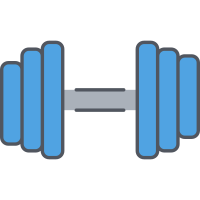

<p style="text-align: center; height: 50px;">
  
</p>

<h1 style="text-align: center;">Char & Giulia Fitness App</h1>

<p style="text-align: center;">By Chardae Schnabel and Giulia Cellerino</p>

## Table of Contents

- [Introduction](#introduction)
- [Motivation](#motivation)
- [Features & Pages](#features--views)
- [Tools Used](#tools-used)
- [Getting Started](#getting-started)
- [Demo Video](#demo-video)
- [Database Schema](#database-schema)
- [Routes](#routes)
- [Future Features](#future-features)
- [Contact](#contact)
- [Acknowledgements](#acknowledgements)

## Introduction

Our app is designed to empower you with confidence and motivation as you embark on your fitness journey.

## Motivation

Giulia and Chardae, like many, often felt gym-intimidated and demotivated at home. Complex routines and lacking guidance made fitness daunting. They saw this shared struggle and the gap in supportive fitness apps.

Traditional apps often lack personalized guidance and motivation. Giulia and Chardae envisioned an app offering tailored workouts, flexible scheduling, and continuous motivation.

This fitness app focuses on building confidence and inspiring users of all levels. They believe everyone deserves empowerment and motivation in their fitness journey. With Char & Giulia Fitness App, users confidently embark, knowing they have a supportive companion every step.

## Features & Pages

This app is made up of the following pages:

- **Homepage:** Provides an overview of the value proposition of the fitness app. This is the only page that the user can access without being registered. It includes options for both login and registration.

- **Login:** Allows users to authenticate and access their accounts securely.

- **Register:** Allows users to register their accounts securely. To validate the registration process, the user must provide a username, email, password, and profile image.

- **Build Your Own Workout:** Enables users to customize their workout routines based on preferences for muscle group, difficulty, and workout type. This information is fetched from the API.

- **Workout:** Presents exercises tailored to user preferences. The user can choose to "Exercise Now" or save the workout for later.

- **Exercise:** This page appears when the user decides to "Exercise Now" on the previous page. It offers detailed information regarding the equipment and instructions for the exercises. A progress bar shows the user's progress throughout their workout. Users can also share the workout with a friend (another registered user on the platform).

- **Calendar:** Displays scheduled workout events, helping users plan their activities. Events can be rescheduled based on both date and time.

- **Profile:** Allows users to view their personal details, view the calendar, delete a saved workout, decide to train for a specific workout, and view workouts sent by friends.

- **Sent Workouts:** Shows a history of sent workout plans, facilitating organization and planning.

- **Sidebar:** Provides quick access to saved workouts.

## Tools Used

- **VS Code** - Source code editor
- **Github** - Version control platform
- **Gitbash** - Command line interface for Git
- **Postman** - API development and testing
- **MySQL** - Relational database management system
- **HTML** - Markup language for creating web pages
- **CSS** - Stylesheet language for styling web pages
- **JavaScript** - Programming language for web development
- **React.js** - JavaScript library for building user interfaces
- **Bootstrap** - Front-end framework for responsive web design
- **Node.js** - JavaScript runtime environment
- **Express** - Web application framework for Node.js
- **JWT** - JSON Web Tokens for authentication
- **Bcrypt** - Password hashing function
- **Trello** - Project management tool for organizing tasks
- **DrawSQL** - Tool for creating database diagrams
- **FullCalendar.io** - JavaScript calendar library for displaying events
- **Material-UI** - React component library for building UIs with Google's Material Design principles
- **Exercise API** - API for retrieving exercises and workout data from [Ninja API](https://api-ninjas.com/api/exercises)

## Getting Started

### Prerequisites

Before you begin, ensure you have the following installed on your local machine:

- [Node.js](https://nodejs.org/) - JavaScript runtime environment
- [npm](https://www.npmjs.com/) - Package managers for Node.js
- [MySQL](https://www.mysql.com/) - Relational database management system
- [Exercise API](https://api-ninjas.com/api/exercises) - Obtain your API key from the website.

### Installation

0. Clone the repository on your local machine and open it.

```javascript
git clone "githublink"
```

1. You need to create two (2) .env files.

- This .env goes in the client folder, as it contains the API Key accessible in the frontend

```javascript
VITE_RAPIDID_API_KEY = "Your_API_KEY";
```

- This .env goes in the root project folder

```javascript
DB_HOST = localhost;
DB_USER = root;
DB_NAME = fitnessapp;
DB_PASS = root;
SUPER_SECRET = your_supersecret;
```

2. Run the database

- Open a tab in your terminal and run:

```mySQL
mysql -u root -p
```

3. Create a new database called fitnessapp

```mySQL
CREATE DATABASE fitnessapp
```

4. Install NPM packages on both the server and on the client.

```javascript
cd fs35-team-A //or any name you have given //
npm install
cd client
npm install
```

5. Populates the database with the correct information.

```javascript
npm run migrate
```

6. To run the backend:

```javascript
npm start
```

7. To run the frontend:

```javascript
cd client
npm run dev
```

Frontend runs on http://localhost:5173/, and backend runs on http://localhost:4000.

## Demo Video

[](https://www.youtube.com/watch?v=DK7YGrpFATw)

## Database Schema

<div style="display: flex; justify-content: center;">
  
</div>

<br/>
<br/>

The database consists of three main tables: `users`, `workouts`, and `exercises`. Below is a summary of their purpose and relationships:

1. **Users Table**

   - **Purpose:** Stores user information.

2. **Workouts Table**

   - **Purpose:** Stores workout sessions, linked to the users who perform and send them.

3. **Exercises Table**

   - **Purpose:** Stores exercises associated with specific workouts.

### Relationships

1. **Users to Workouts (1:N)**

   - **Relationship:** One user can have multiple workouts.
   - **Details:** The `user_id` column in the `workouts` table references the `id` column in the `users` table.

2. **Users to Workouts (1:N) via `sender_id`**

   - **Relationship:** One user can send or create multiple workouts.
   - **Details:** The `sender_id` column in the `workouts` table references the `id` column in the `users` table.

3. **Workouts to Exercises (1:N)**
   - **Relationship:** One workout can have multiple exercises.
   - **Details:** The `workout_id` column in the `exercises` table references the `id` column in the `workouts` table.

### Summary of Relationships

- **Users to Workouts (user_id):** One user (`users.id`) can have many workouts (`workouts.user_id`).
- **Users to Workouts (sender_id):** One user (`users.id`) can send many workouts (`workouts.sender_id`).
- **Workouts to Exercises:** One workout (`workouts.id`) can include many exercises (`exercises.workout_id`).

These relationships ensure that each workout is linked to a specific user and can include multiple exercises, and they allow tracking of both the user performing the workout and the user who created it.

### Example Queries

The following SQL queries demonstrate how to interact with the database:

1. This query retrieves all workout sessions associated with a specific user, identified by their user_id.

```sql
 SELECT * FROM workouts WHERE user_id = 'specific_user_id';
```

2. This query retrieves all exercises included in a specific workout session, identified by its workout_id

```sql
 SELECT * FROM exercises WHERE workout_id = 'specific_workout_id';
```

3. This query retrieves all workout sessions created by a specific user, identified by their sender_id.

```sql
SELECT * FROM workouts WHERE sender_id = 'specific_user_id';
```

These queries provide insights into how data is structured and retrieved within the database, facilitating understanding of the relationships between users, workouts, and exercises.

## Routes

In this section, we outline the various routes available in our application. These routes facilitate communication between the client and server, enabling functionalities such as fetching workout data, user registration, and more. Below, we provide detailed descriptions of each endpoint, including the necessary HTTP methods, request structures, and expected responses.

### End Points

https://docs.google.com/document/d/1VD0Nsywif69Nr0MCx-je22KXIx5FMICRA2M1A-4CoNg/edit

### API Route

We used [Ninja API](https://api-ninjas.com/api/exercises) to fetch the workouts.

- URI: `/api/workouts`
- HTTP Method: `GET`
- Description: Fetches workouts based on muscle group, difficulty, and type.
- Request Object:

```json
{
  "headers": {
    "Content-Type": "application/json",
    "authorization": "Bearer <token>"
  }
}
```

- Request Object: it is an array of objects. Inside each object there is the following:

```json
[
  {
    "difficulty": "string",
    "equipment": "string",
    "instructions": "string",
    "muscle": "string",
    "name": "string",
    "type": "string"
  }
]
```

## Future Features

There are plenty of ideas to make this app bigger and better, here below a snippet:

- Timer Option: Implement a timer feature to track the duration of each exercise.

- Advanced Workout Analytics: Implement advanced analytics to provide users with insights into their workout performance over time, including duration, frequency, muscle group.

- Advanced Workout Analytics: Implement advanced analytics to provide users with insights into their workout performance over time, including duration, frequency, muscle group.

- Enhanced Customization Options: Allow users to further customize their workout plans though filters for workout search (e.g., specific equipment, workout duration).

- Gamification: Add gamification elements to make workouts more engaging and fun, such as achievements and badges for reaching milestones, daily and weekly challenges to keep users motivated.

- Accessibility Enhancements: Make the app more accessible to users with disabilities. Implementing voice control navigation options.

## Contact

- Giulia Cellerino - giulia.cellerino@icloud.com
- Chardae Schnabel - chardaeschnabel@gmail.com

## Acknowledgements

- Teacher [Germinal Camps](https://es.linkedin.com/in/germinal-camps)
- TA [Zoe Laventhol](https://www.linkedin.com/in/zoe-laventhol)
- TA [Pia Prozesky](https://www.linkedin.com/in/pia-prozesky)
